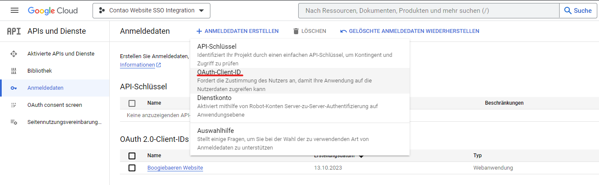

# Contao Google SSO Bundle

Adds a new login url (`/contao/login_sso`) to log into the Contao backend using existing users
inside a Google Workspace instance.

## Installation

Install the bundle via composer: `composer require boogiebaeren/contao-google-sso-bundle`
or install it via the Contao Manager.

## Configuration

You need to define two environment variables:

- GOOGLE_SSO_CLIENTID
- GOOGLE_SSO_CLIENTSECRET

You need to be an administrator of a Google Workspace instance to create a new OAuth client.
First create a new project inside the [Google Cloud Console](https://console.cloud.google.com/),
then create a new OAuth client.

Then select "Web application" as the application type, enter a name and add an authorized redirection
uri `https://<your-domain>/contao/login_sso/redirect`.
After you've created the OAuth client, you can copy the client id and client secret into a `.env.local` file in the
root folder of your Contao installation.

**Don't forget to set the usertype to "intern" in the OAuth consent screen or otherwise any google user could log in!**

After you've configured the environment variables, you can log in using the new login
url (`https://<your-domain>/contao/login_sso`).

